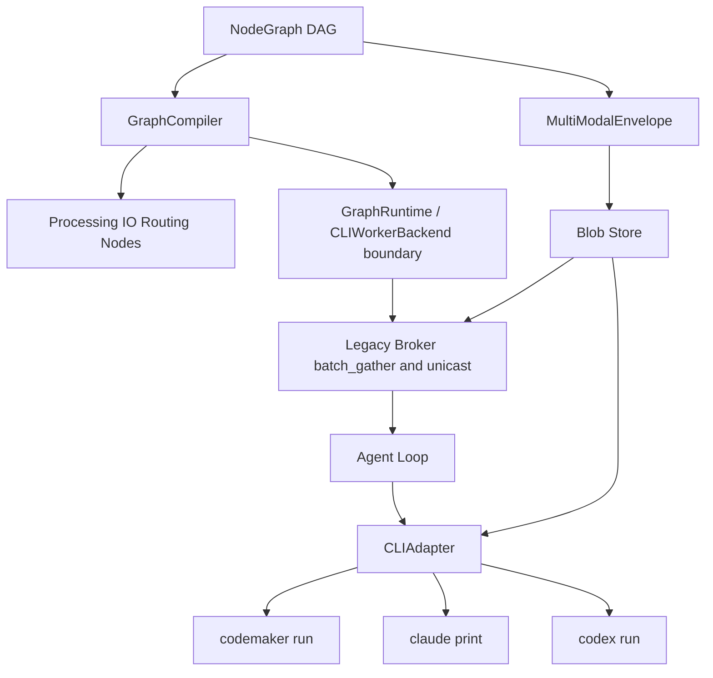
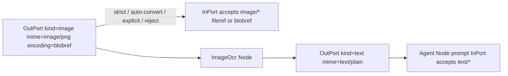

# 多 CLI 接入 + 节点化工作流 + 多模态消息（历史脑暴 / adapter 参考）

> 当前清理定位（2026-05-09）：本文是早期工程脑暴和 adapter 参考，不是当前项目主线、ADR、规范或 API 草案。
> 当前主线是 **GuLiCode desktop / top Agent -> GraphRuntimeControlPlane -> GraphRuntime -> AgentNode queues / outgoing batches / joins / workspace events -> CLIWorkerBackend adapters**。
> 文中的 CodeMaker、TCP broker、`CodeMakerCluster`、`show-registry` / `dispatch`、Ryven 可视化编辑器内容，应按 backend adapter / legacy broker / 延后 visual-editor 资料理解。
>
> 原始目的：把"多 CLI + 节点工作流 + 多模态"这条线在架构、协议、CLI Adapter、节点契约、迁移路径上的岔路写清楚，便于后续拆 ROADMAP 与排期。
>
> 不在本次范围：完整 schema、UI 设计、代码改动、ROADMAP / SKILL 修订（仅在文末以"待办"形式标出）。

## 1. 历史目标与当前定位

历史目标曾是把当时的 `multi_agent_tcp`（围绕 CodeMaker CLI 的薄编排框架）扩成一个**多 CLI agent 的节点化工作流编排器**：

- **接入多种 agent CLI**：CodeMaker CLI（已支持）、Claude Code CLI、Codex CLI 等同类非交互式编码代理，未来还应能挂自研 CLI。
- **以节点系统组织 agent 间协作**：不再只暴露 `run_parallel` / `run_chain` / `run_single` 三种 Python API 调用模式，而是把"agent 调用 + 消息处理"建模成一张**有向图**；图里既有"调一个 CLI"的节点，也有"做消息格式化、字段抽取、模板填充"的处理节点，用户能通过往图里加节点来定义任意中间处理。
- **支持多模态信息传递**：节点之间的边能传图像、文本、（次要：音频）以及通用二进制；agent 节点在调具体 CLI 之前，由 adapter 把多模态信封落地成 CLI 能消费的形式（文件路径 / inline base64 / @file 引用）。
- **headless 优先**：本轮先把"图执行运行时 + 节点契约 + CLI Adapter + 多模态数据面"做对；可视化编辑器（vendored Ryven）在最后一步复用，不重写。

按当前口径，这条线应收敛为 **CLIWorkerBackend / CLIAdapter 后端适配层**，服务 GuLiCode + GraphRuntime 主线，而不是重新定义产品架构中心。

历史一句话：把当时框架从**"调 CodeMaker 的薄编排"** 演化为**"多 CLI agent 节点编排 + 多模态消息总线"**。现在阅读时应把它理解为 adapter / worker execution 脑暴。

## 2. 与当时基线的张力（历史记录）

当时的新目标会同时撞到 4 个位置，列出来便于后续逐项处理。当前实现和主线已经变化，以下内容只作为迁移背景：

| # | 位置 | 现状 | 与新目标的冲突 | 处理方向 |
|---|------|------|----------------|----------|
| 1 | [`ROADMAP.md`](../ROADMAP.md) 第 247 行 | "不做清单"明确写：模型抽象层不做，绑定 CodeMaker CLI 是优势 | 新目标的核心就是"接入多 CLI"，必然需要一层抽象 | **撤销**该条；改写"不做清单"，把"不做"改为"做最薄的 CLI Adapter，不做模型抽象层"（重点是适配进程 IO，不是适配模型推理） |
| 2 | [`protocol.py`](../protocol.py) 第 8-19 行 | 帧 = 4-byte 大端长度 + UTF-8 JSON；`0xFFF_FFFF` ≈ 256 MiB 上限；`encode_frame` / `read_frame` 完全文本 | 二进制（图像/音频/任意 blob）无原生承载 | **扩展**而非替换：新增 `blob_put` / `blob_get` 帧类型，二进制走 base64 字段，仍走 4-byte length + JSON；后续若需要 multipart 二进制帧再升级（开放项） |
| 3 | [`codemaker_bridge.py`](../codemaker_bridge.py) 第 32 / 47-49 / 69-84 / 113 行 | 通篇硬编码 `'codemaker'` 命令、`netease-codemaker/` 前缀校验、`run_stub_message` + `-f` UTF-8 文件、NDJSON 输出（`extract_final_text` 在 [`cluster.py`](../cluster.py) 第 249-264 行） | Claude Code / Codex CLI 的命令名、prompt 传递方式、模型前缀、输出格式都与 CodeMaker 不一致 | **重构**为 `CLIAdapter` 抽象 + `CodeMakerAdapter` 第一实现；保持现有行为兼容，新 adapter 平行加入 |
| 4 | [`cluster.py`](../cluster.py) 第 68-84 行 `WorkerConfig.to_agent_json` | 写死 `"role": "codemaker"` / `"mode": "codemaker-worker"` / `codemaker.*` 配置块 | 注册一个 Claude/Codex worker 时缺乏字段表达 | **扩展**：新增 `cli_kind` / `adapter_options`；旧字段保持兼容（不带 `cli_kind` 视作 `codemaker`） |

> 注：`ROADMAP.md` 第 31 行 ASCII 架构图里也写了同一条"✗ 模型抽象层"，撤销时两处一起改。

## 3. CLI Adapter 抽象（仍有参考价值）

### 3.1 设计目标

- **一层薄壳**：只适配进程 IO（怎么 spawn、怎么递 prompt、怎么解输出、怎么塞文件、怎么上下文续命），**不做** LLM 推理、tool routing、对话历史管理（这些 CLI 自己已实现，与 ROADMAP 的"薄框架"原则一致）。
- **统一输出**：所有 adapter 把 CLI 的差异化输出归一化为 runtime/backend 可消费的结果结构。文中沿用当时的 [`cluster.py`](../cluster.py) / `WorkerResult` 表述；当前新文档应优先写 `CLIWorkerBackend` 边界。
- **可发现的能力声明**：每个 adapter 暴露一份 capabilities（是否支持非交互模式、是否支持文件附件、是否支持 NDJSON、是否支持 streaming），让节点图编译器（GraphCompiler：节点图 → 编排原语）能选择正确的调用路径。

> 术语澄清：本节出现的"编排器 / 编译器"专指**框架内部**把节点图拍平成 broker 调用的那一层组件，**不是**指"Cursor / CodeMaker 之类的上游决策者"。本框架自 2026-04-30 起已不再使用"上游/下游"这种角色对称破坏的描述（详见新增的§10"对等通信原语 vs 编排原语"）。

### 3.2 抽象方法集合（候选）

```python
class CLIAdapter:
    cli_kind: str
    capabilities: Capabilities  # supports_attachments, supports_ndjson, ...

    def validate_config(self, cfg: dict) -> AdapterRuntime: ...
    def model_prefix_rules(self) -> list[str]: ...  # ["netease-codemaker/", ...]

    def build_argv(self, prompt: str, attachments: list[Path], rt: AdapterRuntime) -> list[str]: ...
    def prompt_passing(self) -> Literal["argv", "file", "stdin"]: ...
    def materialize_attachments(self, env: list[MultiModalEnvelope]) -> list[Path]: ...

    def parse_output(self, stdout: str, stderr: str, returncode: int) -> WorkerResult: ...

    async def health_check(self, rt: AdapterRuntime) -> bool: ...
```

> 复用层面：当前 [`codemaker_bridge.py`](../codemaker_bridge.py) `_parse_codemaker_cfg` / `_build_cmd_with_prompt_file` / `_write_prompt_utf8_file` 等私有函数本质上就是 CodeMaker 的实现，重构时整体迁入 `CodeMakerAdapter`。

### 3.3 三类 CLI 对照表

| 维度 | CodeMaker CLI（已落地） | Claude Code CLI（TODO: spike） | Codex CLI（TODO: spike） |
|------|------------------------|-------------------------------|--------------------------|
| 命令 | `codemaker run --format json` | `claude` 系列（`--print` 等非交互 flag 待确认） | `codex` 系列（待确认） |
| Prompt 传递 | 短 stub 在 argv，长 prompt 走 `-f file.md`（避免 Windows argv 编码） | TODO: spike | TODO: spike |
| 模型前缀 | `netease-codemaker/<model>`，CLI 强制（[`codemaker_bridge.py`](../codemaker_bridge.py) 第 47-49 行 warn） | TODO: spike（Anthropic 自家通常无前缀，但 oh-my-opencode 体系下也走 `netease-codemaker/` 复用，需确认） | TODO: spike |
| 输出格式 | NDJSON，每行一个 `{"type": ..., "part": {...}}`，最终文本在 `type:"text"` 条目（[`cluster.py`](../cluster.py) 第 249-264 行 `extract_final_text`） | TODO: spike（推断：plain text 或自定义 JSON） | TODO: spike |
| 文件附件 | 仅支持 `-f` 提供单个 prompt 文件；其它附件靠 prompt 内引用路径 | TODO: spike | TODO: spike |
| Permission 模型 | `codemaker.json` `permission` 字段；非 `"allow"` 时非交互模式可能挂起（[`codemaker_bridge.py`](../codemaker_bridge.py) 第 131-150 行 warn） | TODO: spike（自有 permission 体系） | TODO: spike |
| Skill / Agent 体系 | `.codemaker/skills`、`.codemaker/agent`、Markdown frontmatter；本框架已用 catalog 注入（[`registry.py`](../registry.py) `build_skill_catalog`） | TODO: spike（Anthropic 有 Skills，结构不同） | TODO: spike |
| Log 位置 | `~/.local/share/codemaker/log` | TODO: spike | TODO: spike |
| 认证 | `CODEMAKER_AUTH_USER` + `CODEMAKER_AUTH_TOKEN/KEY` 环境变量 | TODO: spike（API key / OAuth） | TODO: spike |

> 表里 **所有 TODO: spike 都不在本次脑暴里编造**——必须在动 adapter 之前各跑一次最小调用确认。

### 3.4 配置层改造（候选字段）

`WorkerConfig` 与 `agents_registry.json` 增加：

```jsonc
{
  "agent-1": {
    "cli_kind": "codemaker",          // 新增；缺省 "codemaker" 兼容旧配置
    "model": "netease-codemaker/kimi-k2.5",
    "cwd": "F:/src/...",
    "adapter_options": {              // 新增；交给具体 adapter 解释
      "prompt_via_file": "auto",
      "anchor_message": null,
      "run_stub_message": null
    },
    "extra_env": { "CODEMAKER_AUTH_KEY": "..." },
    "skills": ["..."],
    "timeout_sec": 1800
  }
}
```

[`registry_ui.py`](../registry_ui.py) 中"Model 下拉"应当依赖所选 `cli_kind` 给出不同候选；不同 cli_kind 的 model 不互通（kimi-k2.5 在 CodeMaker 走 netease aigw，在 Claude Code 体系下不一定可用）。

## 4. Headless 节点运行时

### 4.1 节点四类

| 类别 | 职责 | 例子 |
|------|------|------|
| **Agent 节点**（详见 §4.1.1） | 绑定并装载一个长生命周期 CLI agent 实例；图运行期间多次经过该节点时复用同一实例收发消息，输出 `WorkerResult` / 会话消息 | `CodeMakerAgent` / `ClaudeCodeAgent` / `CodexAgent` |
| **处理节点（pure function）** | 纯函数式 message 转换 | 模板填充 `Jinja2Render`、字段抽取 `JsonPathPick`、Markdown→纯文本 `MdStrip`、image resize `ImageResize`、image → base64 `ImageEncodeBase64`、JSON merge `JsonMerge` |
| **路由节点** | 控制流 | `FanOut`（一份输入复制成 N 份）、`FanIn`（N 份合并）、`Switch`（按用户提供的 `when` 谓词分支，对应 ROADMAP P2 的条件路由） |
| **I/O 节点** | 与外部世界交互 | `FileRead` / `FileWrite` / `HttpGet` / `McpCall` / `BlobPut` / `BlobGet` |

> **不在节点系统里重新实现 LLM 推理 / tool calling / 任务规划**——这些仍由 Agent 节点背后的 CLI 自己完成，节点系统只做"消息怎么进出 agent"。

### 4.1.1 Agent 节点的可视化配置面（重点）

**Agent 节点是节点系统里唯一负责"装载一个对等 agent CLI"的节点类型**——即用户在可视化编辑器里**拖出来一个 Agent 节点 = 声明一个可在图运行期间被拉起并复用的 agent 实例**。它对应的运行时实体就是 §3 的 `WorkerConfig` + `CLIAdapter` 组合（一个 Agent 节点 ≈ 一个 worker + 它的 adapter + 图运行期会话状态）。

关键生命周期语义：

- 第一次经过某个 Agent 节点时，GraphRuntime 按该节点配置拉起或绑定对应 CLI agent 实例。
- 同一次蓝图运行中再次经过该 Agent 节点时，不重新 spawn，也不关闭进程，而是直接把新消息发送到该节点已绑定的 agent 实例。
- Agent 节点可以出现在循环、反馈、协作链路中；循环每次回到同一 Agent 节点时应复用该 agent 的上下文与进程状态。
- 整张蓝图运行结束、取消或失败收尾时，GraphRuntime 统一关闭本次运行创建的 agent 实例；挂接到外部已有 agent 的节点只解除绑定，不擅自销毁外部实例。
- `timeout_sec` 约束单次消息处理，不代表 agent 实例生命周期上限。

#### Agent 节点执行模式：blocking / nonblocking

Agent 节点不是只有一种执行语义。按对当前分支控制流的影响，至少分为：

- **阻塞 AgentNode**：触发后阻塞当前执行分支，等待本轮消息结果，再决定当前分支继续、失败、驳回或进入其它路径；它不阻塞整张蓝图，也不阻塞其它并行分支。典型用途是审批技术提案、评审实现方案、汇总多路结果、质量门禁、决定后续 AgentNode 是否可以实施。
- **非阻塞 AgentNode**：触发后启动或复用 agent 实例并提交后台任务，当前执行分支立即继续。它通常承担执行者职责，例如开发某个模块、生成资产、跑长时间验证、后台调研。当前分支短期内不等待其结果；完成后通过事件和共享工作区 manifest 反馈给蓝图。

推荐新增字段：

| 字段 | 值 | 含义 |
|------|----|------|
| `execution_mode` | `blocking` / `nonblocking` | 是否阻塞当前执行分支等待本轮结果 |
| `completion_event` | bool | 非阻塞任务完成后是否发事件 |
| `event_topic` | string | 完成/失败/进度事件主题 |
| `workspace_id` | string | 该节点使用的共享工作区 |
| `read_scope` / `write_scope` / `artifact_scope` | glob list | 该节点允许读取、写入、产出的位置 |
| `result_policy` | `return` / `event` / `manifest` | 本轮结果如何回流 |

阻塞 AgentNode 的直接输出应包含 `completed` / `failed` / `answer` / `result` / `status`，用于驱动当前分支。非阻塞 AgentNode 的直接输出应包含 `started` / `failed_to_start` / `job_ref` / `agent_ref` / `workspace_ref`，最终结果通过事件总线和共享工作区回流。

#### 用户在 Agent 节点上要声明的字段（节点检视面板）

| 字段 | 必填 | 控件类型 | 来源 / 联动 |
|------|------|----------|-------------|
| `cli_kind` | ✅ | 下拉 | `codemaker` / `claude_code` / `codex` / `custom`；决定下面字段的可选范围与默认值（见 §3.4） |
| `model` | ✅ | 联动下拉 | 依 `cli_kind` 决定候选；如 `cli_kind=codemaker` → 必须 `netease-codemaker/<...>` 前缀（CodeMaker CLI 强制） |
| `cwd` | ✅ | 路径选择器 | spawn 该 agent 子进程的工作目录；CodeMaker 体系下需有 `codemaker.json` 且 `permission: "allow"` |
| `agent_id` | ⚠️ | 文本（节点 id 默认派生） | broker 内寻址；同图内不能重复；可视化编辑器默认用节点 id，允许覆写以连入已有 `agents_registry.json` |
| `skills` | ⭕ | 多选弹窗 | 仅 CodeMaker / OpenCode 体系生效；Claude / Codex 走各自 adapter 内置 skill 机制（§7.2） |
| `timeout_sec` | ⭕ | 数字 | 单次 prompt 最大执行时间 |
| `adapter_options` | ⭕ | 折叠面板（按 `cli_kind` 渲染不同字段） | 例：CodeMaker 的 `prompt_via_file` / `anchor_message` / `run_stub_message` 等 |
| `extra_env` | ⭕ | key/value 表 | 注入子进程环境变量（如 `CODEMAKER_AUTH_TOKEN`） |
| `execution_mode` | ✅ | 分段控件 | `blocking` / `nonblocking`；决定执行线是否等待本轮结果 |
| `workspace_id` | ⭕ | 下拉/文本 | 非阻塞任务写 manifest 与产物的共享工作区 |
| `read_scope` / `write_scope` / `artifact_scope` | ⭕ | glob 列表 | 约束该 AgentNode 在共享工作区内的读写与产物边界 |

> **检视面板渲染规则**：选完 `cli_kind` 后，整张面板按对应 `CLIAdapter.cli_kind` 重新渲染——这与 §3.4 `agents_registry.json.adapter_options` 是同一份 schema，仅承载形态从 JSON 改成节点表单。

#### 输入端口（用户在节点上看到的"左侧引脚"）

| 端口名 | 必备 | accepts | 含义 |
|--------|------|---------|------|
| `prompt` | ✅ | `text/plain` / `text/markdown`（自动转 plain） | 给该 agent 的指令；可来自上游处理节点（模板填充、字段抽取）或用户内联文本 |
| `attachments` | ⭕ | `image/*` / `audio/*`（次要） / `application/octet-stream` / `file/*` | 多端口或单 list 端口；adapter 在首次启动前或每次发送消息前调 `materialize_attachments` 把它们落地为 CLI 能消费的形式（文件路径 / inline base64 / @file 引用） |
| `context` | ⭕ | `application/json` 或 `text/*` | `run_chain` 风格上一步的结构化上下文（可选，由 GraphCompiler 自动接入） |
| `gather_id` | ⭕（编排器用） | `text/plain` | broker `batch_gather` 元信息；通常由编译器自动接入，用户不直接连 |

#### 输出端口（用户在节点上看到的"右侧引脚"）

| 端口名 | emits | 含义 |
|--------|-------|------|
| `answer` | `text/plain` / `text/markdown` | adapter `parse_output` 后的最终文本（CodeMaker NDJSON 提取的 `type:"text"` 文本；Claude/Codex 由各自 adapter 自定 schema） |
| `attachments_out` | `image/*` / `file/*` 等 `MultiModalEnvelope` 列表 | agent 在执行过程中产出的图像 / 文件（如调 `ImageDescribe` 生成图等场景）。CodeMaker 当前不产 attachments，端口可空连 |
| `status` | `text/plain` 枚举 | `success` / `error` / `timeout` / `empty` |
| `raw` | `application/json` | 调试/审计用 `WorkerResult.to_raw_dict()`：含 `raw_stdout` / `stderr` / `elapsed_sec`；通常不接，仅 trace 节点订阅 |
| `job_ref` | `application/json` | 非阻塞模式提交后台任务后的句柄，包含 `job_id` / `node_id` / `agent_id` / `workspace_id` |
| `agent_ref` | `application/json` | 该节点绑定的运行期 agent 实例引用，供 `ResetAgent` / `StopAgent` / `InspectAgent` 等高级节点使用 |
| `workspace_ref` | `application/json` | 非阻塞任务对应共享工作区引用 |

#### 与 `agents_registry.json` 的关系

- **Agent 节点 = registry 条目的可视化包装**：可视化编辑器里"新建 Agent 节点"在底层就是写一条 `WorkerConfig`；保存图时把节点上的字段反写到一份临时或正式的 `agents_registry.json`。
- **两种使用模式**：
  - **挂接已有 agent**：把节点 `agent_id` 指向 registry 中现有条目（`cli_kind` / `model` / `cwd` 等字段从 registry 读出，节点面板只读展示 + 可覆写 `prompt` / `attachments` 端口）。
  - **新建 agent**：节点面板填全字段，保存时追加到 registry（或保存到图本地的"图内 agents"块，避免污染全局 registry）。
- 与 [`registry_ui.py`](../registry_ui.py) 的关系：可视化节点编辑器**不替代** `registry_ui.py`；前者编辑"图 + 节点配置"，后者编辑"全局 agent 池"。两者通过同一份 `WorkerConfig` schema 互通。

#### 编译目标

每个 Agent 节点最终被 GraphCompiler 编译为"agent 实例声明 + 消息发送步骤"，而不是"每次经过节点就 spawn 一次 CLI"：

- 单 Agent 节点 → ensure/bind `agent_id`，随后向该实例发送一次消息；同次图运行中后续经过继续复用
- 多 Agent 节点共享一个 fan-out 上游 → 先确保各 Agent 实例存在，再并行发送消息，可复用 `cluster.run_parallel([(agent_id, body), ...])` 作为消息调度原语
- 线性 Agent 节点链 → 先确保链上 Agent 实例存在，再按链路发送消息；`cluster.run_chain([(agent_id, body), ...])` 只能表示消息拓扑，不表示逐节点 spawn/teardown
- fan-out → reduce Agent → 先确保 fan-out 与 reduce Agent 实例存在，再执行 `cluster.run_parallel_reduce(...)` 风格的消息汇聚
- 任意 DAG / 含 `Switch(when=...)` → ROADMAP P2 的 `cluster.run_dag(...)`

阻塞模式下，GraphRuntime 等待本轮消息结果再推进当前分支；非阻塞模式下，GraphRuntime 只确保任务已提交并返回 `job_ref`，当前分支继续，后台完成后发 `TaskCompleted` / `TaskFailed` / `WorkspaceChanged` 等事件。

详见 §6.1 编译表。

### 4.1.2 共享工作区：blackboard + 文件空间

共享工作区不是普通临时目录，而是多 Agent 协作的 blackboard 与版本化文件空间。它需要让后台 AgentNode 的成果可发现、可审计、可继续处理。

建议最小结构：

```text
workspace_root/
  source/       # 真实源码或挂载入口
  artifacts/    # 生成物、图片、报告、导出文件
  logs/         # agent 运行日志、stderr/stdout 摘要
  temp/         # 临时文件
  manifests/    # job manifest 与 workspace manifest
```

非阻塞 AgentNode 完成后必须写 job manifest：

```jsonc
{
  "job_id": "job-123",
  "run_id": "run-001",
  "node_id": "frontend-worker",
  "agent_id": "agent-2",
  "workspace_id": "main-workspace",
  "status": "completed",
  "changed_files": ["src/ui/Panel.tsx"],
  "created_files": [],
  "deleted_files": [],
  "artifacts": [],
  "summary": "Implemented panel layout and state handling.",
  "risks": ["Mobile layout not visually verified."],
  "tests": ["npm test -- Panel"],
  "completed_at": "2026-05-02T..."
}
```

事件至少包含：

- `TaskStarted`
- `TaskProgress`
- `TaskCompleted`
- `TaskFailed`
- `WorkspaceChanged`
- `ReviewRequested`

事件 payload 至少带 `run_id`、`branch_id`、`node_id`、`agent_id`、`job_id`、`workspace_id`、`manifest_path`、`changed_files`、`status`。相关 AgentNode 收到事件后不应盲扫整个工作区，而应先读取 manifest，再按需读取改动文件。

写入边界按阶段推进：

1. 第一版：`read_scope` / `write_scope` / `artifact_scope` 检查 + manifest 记录。
2. 第二版：文件锁或 lease，避免两个非阻塞 AgentNode 同时改同一路径。
3. 第三版：每个 AgentNode 独立 worktree，完成后通过 merge/review 节点合并。

### 4.2 端口数据契约：`MultiModalEnvelope`

为避免每加一种媒体类型都要新加端口，统一用一种"信封"：

```jsonc
{
  "kind": "text" | "image" | "audio" | "file" | "blob",
  "mime": "text/plain" | "text/markdown" | "image/png" | "image/jpeg"
        | "audio/wav" | "application/json" | "application/octet-stream",
  "encoding": "inline" | "fileref" | "blobref",
  "value":
      "string"                      // encoding == "inline" && kind == "text"
    | "<base64>"                    // encoding == "inline" && kind != "text"
    | { "path": "C:/abs/path.png" } // encoding == "fileref"
    | { "blob_id": "blob-abc123" }  // encoding == "blobref"
  ,
  "meta": {
    "source_node": "node-7",
    "produced_at": "2026-04-30T...",
    "size_bytes": 12345,
    "checksum_sha256": "...",
    "extra": {}
  }
}
```

要点：
- **一种边对应一种容器**，不同模态走同一信封；节点端口只用 `(kind, mime)` 集合声明它"接受什么"。
- `encoding` 三档对应 §5 的三种承载策略，避免节点知道存储细节。
- `meta.checksum_sha256` 让 blob store 能 dedup；`meta.source_node` 让 trace 能反向追溯。
- text 默认 `encoding: "inline"` + `value: string`，**回退路径与现状一致**（不破坏旧代码）。

### 4.3 端口 schema 与编辑期类型校验

每个端口声明：

```jsonc
{
  "name": "result_image",
  "direction": "out",
  "accepts": [
    { "kind": "image", "mime": "image/*" }
  ],
  "encodings": ["fileref", "blobref"]
}
```

编辑期校验直接复用 [`ryvencore-vs-ue5-blueprint-gaps-2-4-8.md`](ryvencore-vs-ue5-blueprint-gaps-2-4-8.md) §2.4 的"严格匹配 / 自动转换 / 显式转换 / 拒绝"四档兼容矩阵：

- 严格：`image/png → image/png`、`text/plain → text/plain`。
- 自动转换：`image/png → image/*`、`text/markdown → text/plain`（隐式 `MdStrip`），UI 提示"已自动适配"。
- 显式：`image/* → text/*` 必须经 `ImageOcr` 或 `ImageDescribe` 节点。
- 拒绝：`audio/* → image/*` 类无明确语义的连接。

未来增加新模态时，只扩兼容矩阵，不动节点代码。

## 5. 多模态数据面

### 5.1 三种承载策略对比

| 策略 | 实现复杂度 | 适用尺寸 | 跨机能力 | 缺点 |
|------|------------|----------|----------|------|
| **inline base64** | 最低（直接 JSON 字段） | 小图（< 几 MB）、短音频 | 有（数据随帧走） | 帧大小受 [`protocol.py`](../protocol.py) `0xFFF_FFFF` ≈ 256 MiB 限制；base64 膨胀 33%；JSON 解析慢 |
| **fileref** | 低（传路径） | 任意大小 | 无（仅同机器临时目录） | 需要清理；权限/路径长度问题（Windows） |
| **blob store** | 中（broker / 独立 KV） | 任意大小 | 有（agent 拉 blob） | 需要新增 `blob_put` / `blob_get` 协议、生命周期管理、配额 |

### 5.2 推荐渐进路径

1. **Phase A**：text 与小图走 inline；adapter 在调 CLI 前若发现 inline 太大，直接落本地临时文件再传 path（沿用 [`codemaker_bridge.py`](../codemaker_bridge.py) `_write_prompt_utf8_file` 思路）。
2. **Phase B**：引入本地 blob store（broker 进程内 dict + 临时文件目录，或单独 SQLite/磁盘），新增 `blob_put` / `blob_get` 帧类型；信封 `encoding: "blobref"` 启用。
3. **Phase C**：跨机时 blob store 走独立服务（`blob_get` 帧扩成可远程拉），再考虑是否引入二进制 multipart 帧（开放项，**不在短期目标**）。

### 5.3 协议层最小扩展

保持 [`protocol.py`](../protocol.py) 现状（4-byte length + UTF-8 JSON）不变。新增帧类型示例：

```jsonc
// 上传：agent → broker
{ "type": "blob_put", "blob_id": "blob-abc", "mime": "image/png", "data_b64": "..." }

// 下载：agent → broker
{ "type": "blob_get", "blob_id": "blob-abc" }

// 响应
{ "type": "blob_chunk", "blob_id": "blob-abc", "data_b64": "...", "eof": true }
```

> 关键约束：blob 帧必须能被现有 `batch_gather` 协议透明转发；建议 broker 给 blob store 一个独立的请求 id 命名空间，避免与 `gather_id` / `reply_to` / `gather_reply`（见 [`broker.py`](../broker.py)）混淆。

## 6. 历史节点 → broker 调度映射（已降级）

> 当前说明：本节描述的是早期 GraphCompiler / broker / cluster 映射想法。当前调度语义应以 `GraphRuntimeControlPlane` / `GraphRuntime` 为中心；broker、TCP、cluster 只作为 CLI worker backend 路径。

### 6.1 编译思路

历史设想中，节点图（DAG）由 GraphCompiler 拍平成"图运行期 agent 实例表 + 消息调度步骤"。表中所有"Agent 节点"均指 [§4.1.1 定义](#411-agent-节点的可视化配置面重点) 的"装载一个对等 agent CLI 的节点类型"。

当前仍然成立的部分是：`GraphRuntime` 维护本次蓝图运行的 `node_id -> agent_instance/session` 映射。第一次经过节点时启动或绑定实例；之后再次经过同一节点只发送消息；整图结束时再统一 teardown 本次运行创建的实例。

| DAG 模式 | 编译目标 |
|----------|----------|
| 多 [Agent 节点](#411-agent-节点的可视化配置面重点) 共享一个 fan-out 节点 | ensure/bind 多个 agent 实例，然后用 `cluster.run_parallel(...)` 风格并行发送消息 + `MultiModalEnvelope` 注入 |
| 多个 [Agent 节点](#411-agent-节点的可视化配置面重点) fan-out → 一个汇聚 [Agent 节点](#411-agent-节点的可视化配置面重点) | ensure/bind fan-out 与 reduce agent 实例，然后用 `cluster.run_parallel_reduce(...)` 风格汇聚消息 |
| 线性 [Agent 节点](#411-agent-节点的可视化配置面重点) 链 | ensure/bind 链上 agent 实例，然后按 `cluster.run_chain(...)` 风格传递消息，`prev_context` 携带 `MultiModalEnvelope` |
| 单 [Agent 节点](#411-agent-节点的可视化配置面重点) | ensure/bind 该 agent 实例，然后用 `cluster.run_single(...)` 风格发送本次消息 |
| 含 `Switch(when=...)` 的非线性图 | 对应 ROADMAP P2 的 `DAG.run_dag(...)`；`when` 是用户函数（可在节点里写普通 Python） |
| 含处理节点 / I/O 节点 | 在编排原语外层做（GraphCompiler 自己执行，不进 broker） |

### 6.2 总体架构图



### 6.3 端口契约对边的影响



> 编辑期校验直接读端口 schema + 全局兼容矩阵；连不上的边在节点编辑器里给出明确原因（"目标端口不接受 image/png，最近的转换路径：ImageOcr → text/plain"），与 §2.5 的反馈层次一致。

## 7. agents_registry.json 与 Skill 体系

### 7.1 注册表字段扩展

详见 §3.4，关键新增 `cli_kind` / `adapter_options` / `extra_env`。**向后兼容规则**：缺省 `cli_kind == "codemaker"`，使旧 `agents_registry.json` 无需迁移。

### 7.2 Skill 注入只对 CodeMaker 有意义

[`registry.py`](../registry.py) 现有的 `build_skill_catalog` / `inject_skills_into_prompt` 把"我有这些 skill，按需 read"的 catalog 表前置到 prompt。这个机制隐含两个前提：

1. **被调 CLI 自带 `read` 工具**（CodeMaker 有，Claude Code 有，Codex 有）。
2. **被调 CLI 把"找到 SKILL.md 后就按它行事"作为约定**——这是 CodeMaker / OpenCode skill 体系的语义，不能假设其它 CLI 默认遵循。

→ 推论：

- Claude Code 有自己的 Skills（Anthropic Skills 文档自成一套），目录结构与触发约定都不同；ClaudeCodeAdapter 应当**用 Claude 自己的 Skill 机制**，不能直接复用 CodeMaker 的 catalog 注入。
- Codex CLI 的等价机制 TODO: spike。
- 短期方案：**catalog 注入只在 `cli_kind == "codemaker"` 时生效**；其它 CLI 走各自的 adapter 内置 skill 注入逻辑。
- registry 的 `skills: [...]` 字段语义不变（仍是项目级 skill 列表），但具体如何注入由 adapter 决定。

## 8. 历史 MVP 路线（不再作为当前优先级）

> 当前说明：以下是 2026-04 期间的脑暴路线。当前优先级已经转为 GuLiCode top-Agent、GraphRuntimeControlPlane、GraphRuntime 队列/批次/join/workspace/events，以及 desktop UI 集成。Ryven 可视化阶段延后。

| 阶段 | 目标 | 关键产出 |
|------|------|----------|
| **① Headless graph runtime** | 节点契约（端口 + 信封）+ 单线程图执行器 + JSON/YAML 图定义 | `multi_agent_tcp/nodes/` 包，含 `Node` / `Port` / `Envelope` / `GraphRunner`；最小内置节点 `Agent` / `Template` / `JsonPathPick` / `FanOut` / `FanIn` |
| **② CLI Adapter 抽象** | 把现有 [`codemaker_bridge.py`](../codemaker_bridge.py) 重构为 `CodeMakerAdapter`，`WorkerConfig` / `agent_loop` 走 adapter 接口 | `multi_agent_tcp/adapters/codemaker.py`；行为零变化（金丝雀） |
| **③ ClaudeCodeAdapter / CodexAdapter** | 各跑一次最小 spike，确认 §3.3 表里 TODO 的真值，再写 adapter | `multi_agent_tcp/adapters/claude_code.py` / `codex.py`；`agents_registry.json` 增加 `cli_kind` |
| **④ MultiModalEnvelope + Blob Store** | 信封落地、`blob_put` / `blob_get` 帧、adapter `materialize_attachments` 实装 | [`protocol.py`](../protocol.py) 增加新帧类型；[`broker.py`](../broker.py) 增加 blob store 子模块 |
| **⑤ 可视化（最后做）** | 把 vendored Ryven UI 复用为节点图编辑器，节点定义复用 ① 的 schema | UI 不重写；只做 NodeGUI 适配，把 Ryven 的 Port/NodeItem 映射到 §4 的端口契约；当前已延后 |

> **每一步都能独立交付**：① 完成后即可用 YAML 跑节点图；② 完成后多 CLI 能并存于一个集群；④ 完成后才解锁多模态；⑤ 是体验加分项，不阻塞功能。

## 9. 风险与开放问题清单

- **R1（必须 spike）**：Claude Code CLI / Codex CLI 的非交互模式、prompt 传递、输出格式、模型前缀、permission 模型在动 adapter 之前必须各跑一次最小调用确认。脑暴里所有 TODO: spike 都属此类。
- **R2（已于 2026-04-30 本轮合并撤销）**：[`ROADMAP.md`](../ROADMAP.md) 第 247 行"不做：模型抽象层" + 第 31 行架构图同条曾与本脑暴互相矛盾。**本轮文档转向时已一次性改写**为"做最薄的 CLI Adapter，不做模型推理抽象"，并在 ROADMAP "不做清单"中保留历史变更说明，与本文档结论对齐。后续若新成员看到此条，请直接读最新 ROADMAP 与 [`.cursor/skills/multi-agent-tcp/ARCHIVE.md`](../../.cursor/skills/multi-agent-tcp/ARCHIVE.md) 顶部归档条目。
- **R3**：跨 CLI permission 体系不统一（CodeMaker 的 `permission` 与 Claude / Codex 的不一致）；编排器无法在单一接口里统一表达"这个任务允许做什么"，至少需要在 adapter 层各自解释。
- **R4**：Windows 路径长度（260 默认上限）与临时文件清理在多模态场景会更敏感；blob store 的本地落盘目录必须有上限与定期 GC。
- **R5**：`batch_gather` 协议（`gather_id` / `reply_to` / `gather_reply` 等帧字段，见 [`broker.py`](../broker.py)）必须能透明承载多模态信封而不破坏 gather 状态机；blob 帧不能复用 `gather_id` 命名空间。
- **R6**：现有 `extract_final_text`（[`cluster.py`](../cluster.py) 第 249-264 行）只能处理 NDJSON 中 `type:"text"` 的条目；Codex CLI 若是纯文本输出，必须由 adapter 在 `parse_output` 里完整接管，不能直接复用。
- **R7**：节点图执行的可观测性与 ROADMAP P1 "执行追踪（Tracing）"应当一起设计——每条边的多模态信封都应能进 trace（至少落 meta，不落 value）。
- **R8（开放）**：是否允许"远端 worker"（broker 与 agent 不同机器）？若要，blob store 必须升级成可远程拉，且涉及网络带宽/安全；本轮脑暴不展开。
- **R9（开放）**：节点图是否需要持久化为可重入的"工作流模板"（带版本号、迁移）？若需要，`MultiModalEnvelope.meta` 还要补 schema 版本；与 [`ryvencore-vs-ue5-blueprint-gaps-2-4-8.md`](ryvencore-vs-ue5-blueprint-gaps-2-4-8.md) §2.3 第 4 层"序列化 / 存档类型"对齐。

## 10. 对等通信原语 vs 编排原语（历史术语澄清）

本节保留当时对旧叙事的纠偏价值。当前项目定位已进一步转向 GuLiCode + GraphRuntime 主线；阅读本节时，应把 peer/broker/dispatch 视为 backend adapter 和 legacy broker 层的术语澄清，而不是新的产品中心。

### 10.1 对等通信原语（peer primitives）

> "我和另一个对等节点说一句话 / 听一句话"——broker 提供的最底层能力，**任何节点（agent CLI / 脚本 / 编排器自己）都能用，且使用时不预设角色**。

| 原语 | 帧/方法 | 谁能发起 | 谁能接收 | 现状 |
|------|---------|----------|----------|------|
| **unicast send** | `send_to(to, body)` | 任意节点 | 任意节点 | ✅ 已实现 |
| **broadcast** | `broadcast(body, exclude_self)` | 任意节点 | 全体注册节点 | ✅ 已实现 |
| **batch_gather** | `batch_gather(id, items)` | 任意节点 | 多个不同 target | ✅ 已实现 |
| **gather_reply** | `send(... gather_reply=id)` | 被 gather 的 target | 原发起方 | ✅ 已实现 |
| **ping/pong** | `ping` / `pong` | broker → 节点 / 节点 → broker | 心跳 | ✅ 已实现 |
| **discovery** | `show-registry` | 任意节点 | 只读快照 | ✅ 已实现（最小） |
| **blob_put / blob_get** | 见 §5.3 | 任意节点 | broker blob store | 🔜 §5 Phase B |
| **conversation_id**（多轮） | 加在 send/gather 帧 | 任意双方 | 任意双方 | 🔜 ROADMAP P2 |

**对称性要求**：发起方 ↔ 接收方角色**完全对称**。同一个 agent CLI 在不同时刻可以是任何一方；broker **不**给某些节点特权。

> 这层原语不预设"谁来调度任务"。一个 agent CLI 可以在自己的 prompt 处理过程中通过 bash 工具触发 `dispatch`（→ batch_gather），让另一个 agent 帮自己干活——这就是**对等协作**的自然实现路径。

### 10.2 编排原语（orchestration primitives）

> "我作为这一次的发起方，要把一组任务按某种拓扑派给一群对等 agent"——基于对等原语之上的便捷封装，**有明确的本次发起方**，但发起方角色**不是固定的**（任何能跑这些方法的节点都可以是这一次的发起方）。

| 原语 | 方法 | 拓扑 | 现状 |
|------|------|------|------|
| **run_single** | `cluster.run_single(worker, body)` | 1 → 1 | ✅ 已实现 |
| **run_parallel** | `cluster.run_parallel(tasks)` | 1 发起 → N agent fan-out | ✅ 已实现 |
| **run_parallel_reduce** | `cluster.run_parallel_reduce(tasks, reduce_worker, reduce_prompt)` | fan-out → reduce | ✅ 已实现 |
| **run_chain** | `cluster.run_chain(tasks)` | 线性 A→B→C | ✅ 已实现 |
| **run_dag**（DAG + 条件路由） | `cluster.run_dag(dag)` | 任意 DAG，节点条件用户函数 | 🔜 ROADMAP P2 |
| **dispatch** CLI | `python -m multi_agent_tcp dispatch ...` | run_parallel 的命令行包装 | ✅ 已实现 |

**对称性要求**：编排原语**不要求**对称——这一次有发起方有接收方是合理的，但**框架不固定谁担任发起方**。下一次另一个 agent 也可以发起。这与"上游/下游"的本质区别是：上游/下游是**身份**（永远是这个角色），发起/接收是**这一次的事件**（下一次可以反过来）。

### 10.3 节点系统（§4-§6）的位置

节点系统位于编排原语之上（详见 §6.1 编译表）：

```
┌─────────────────────────────────────────────────────────────────┐
│ NodeGraph DAG（用户定义）                                        │
└─────────────────────┬───────────────────────────────────────────┘
                      │  GraphCompiler 拍平
                      ▼
┌─────────────────────────────────────────────────────────────────┐
│ 编排原语（run_parallel / run_chain / run_dag / ...）            │
└─────────────────────┬───────────────────────────────────────────┘
                      │  cluster + adapter
                      ▼
┌─────────────────────────────────────────────────────────────────┐
│ 对等通信原语（send_to / batch_gather / blob_put / ...）         │
└─────────────────────┬───────────────────────────────────────────┘
                      │  TCP 帧
                      ▼
┌─────────────────────────────────────────────────────────────────┐
│ Broker 通信总线 ↔ 多个对等 agent CLI / 脚本                      │
└─────────────────────────────────────────────────────────────────┘
```

> **新成员阅读建议**：理解"为什么 batch_gather 和 run_parallel 看起来像同一件事但分两层"——前者是任何节点都能用的对等通信能力，后者是 cluster 给"这一次的发起方"提供的便捷封装（多了 retry、skill 注入、结构化结果整理等），**两层都不预设固定角色**。

### 10.4 旧叙事的退场

旧叙事里"Cursor / CodeMaker 是 orchestrator，CodeMaker workers 是被调度方"假设了**身份级**的角色不对称——orchestrator 永远是 Cursor，worker 永远是 CodeMaker。

新叙事下：

- "orchestrator" 这个词**不再使用**，改用"本次发起方（initiator）"——只对**单次调用**生效；
- "worker" 仍可作为"在 broker 上注册并接收消息的 agent 进程"的中性词，但**不暗示**它只能被叫不能叫别人；任何 worker 也可以反过来作为 initiator 调 `dispatch`；
- `cluster.py` 中的 `CodeMakerCluster` 类名**保留**（向后兼容），但语义重定位为"发起方便捷类"——它只是恰好被命名为 Cluster，未来 `ClusterAdapterRegistry` / `MultiCliCluster` 等更中性的别名可能会引入（不在本轮范围）。

## 11. 关联文档

- 节点编辑器与类型系统的脑暴：[`ryvencore-vs-ue5-blueprint-gaps-2-4-8.md`](ryvencore-vs-ue5-blueprint-gaps-2-4-8.md)（本文 §4.3 兼容矩阵直接复用其 §2.4）。
- vendored Ryven 节点外观与主题：[`vendor-ryvencore-qt-node-appearance.md`](vendor-ryvencore-qt-node-appearance.md)（步骤 ⑤ 可视化阶段会重读）。
- 框架定位与"不做清单"：[`ROADMAP.md`](../ROADMAP.md)（R2 风险点）。
- CodeMaker CLI 行为参考（**本地、未入公共仓**）：[`codemaker_cli.md`](../codemaker_cli.md)；其它 CLI 的等价文档需自行收集。
- 当前 CodeMaker 桥接实现：[`codemaker_bridge.py`](../codemaker_bridge.py)、[`cluster.py`](../cluster.py)、[`registry.py`](../registry.py)、[`protocol.py`](../protocol.py)、[`broker.py`](../broker.py)。

## 修订记录

- **2026-04-30 v2 修订（项目定位转向：peer-to-peer agent CLI 协作）**：
  - §3.1 把"上游编译器"改写为"节点图编译器（GraphCompiler）"，并加术语澄清——"编排器/编译器"指框架内部组件，**不**指 Cursor / CodeMaker 之类的"上游决策者"。
  - §9 R2 风险点标记为"已于 2026-04-30 本轮合并撤销"——ROADMAP 第 247 行"不做模型抽象层"已与本脑暴一次性合并撤销，改为"做最薄的 CLI Adapter"。
  - 新增 §10"对等通信原语 vs 编排原语（peer primitives vs orchestration primitives）"，明确两类原语的对称性要求与节点系统的位置；旧叙事"Cursor / CodeMaker 是 orchestrator + CodeMaker workers"在该节标注为已退场。
  - 关联文档与修订记录章号顺延（旧 §10/§11 → §11/§12）。
  - 本轮**未改任何 .py 代码**，只是文档重写/配套同步；详见 [`.cursor/skills/multi-agent-tcp/ARCHIVE.md`](../../.cursor/skills/multi-agent-tcp/ARCHIVE.md) 顶部归档条目。
- **初版**：把"接入 Claude Code / Codex / CodeMaker 等多 CLI、节点化工作流、多模态消息"的短期目标脑暴落地；标注与 ROADMAP / 现有代码的张力点；列出 MVP 五步路线与风险清单。
