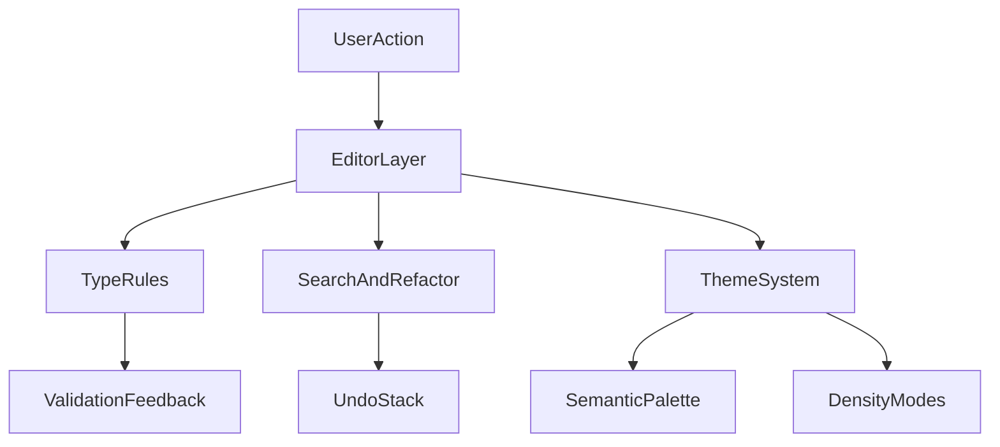

# 相对 UE5 蓝图的改进方向（摘录：类型系统、编辑效率、信息密度）

本文档记录与 UE5 蓝图系统对比时，**当前流图栈**（Ryven / ryvencore + ryvencore_qt 及上层业务）在以下三方面的**差距与可改进点**，便于排期与架构讨论。

定位说明：UE5 蓝图为引擎内一等公民的可视化脚本；本栈为通用 **Qt 节点编辑器 + Python 执行模型**。对比目的为取长补短，而非要求功能对等。

结合当前 vendored `ryvencore_qt` 的能力边界，这里重点围绕以下既有基础设施展开脑暴：

- `FlowView` 已提供撤销/重做、节点选择变化、连接合法性请求等编辑器骨架。
- `FlowCommands` 已提供 undo command 抽象，适合作为批量重构与半自动修复的基础设施。
- `NodeGUI` / `NodeInspector` 已提供输入 widget、Inspector、选择联动，是类型预览、错误解释、搜索结果承载的天然挂载点。
- `Design` / `FlowTheme` 已具备多主题、性能模式和节点外观控制，可继续承载语义色板、高密度模式、可访问性策略。

---

## 2. 类型系统与连线安全

### 2.1 UE5 侧特征

- Pin **强类型**，自动转换规则明确（含 Make/Break、Enum、软引用等）。
- 大量错误在**编辑期**即可拦截，连线语义清晰。
- 从端口往外拖时，候选节点集合会天然受类型约束，减少“能连但其实不该连”的歧义。

### 2.2 当前系统常见缺口

- 通用节点图多为**弱类型或半类型**；若端口层未做严格校验，易出现**运行时才暴露**的数据流错误。
- 类型不统一时，难以做“仅显示可连接目标”“仅推荐可落地转换链”这类智能提示。
- 若图会被序列化、复制、持久化或跨版本加载，那么“连得上”不等于“存得下、还原得回、升级得动”。

### 2.3 问题拆分：不要把“类型”只理解成端口名字

这里建议把类型系统拆成四层，否则设计很容易在中途失焦。

#### 1) 视觉类型

用于用户第一眼识别：

- 颜色
- pin 形状
- 连接线样式
- label 或 badge

这层主要解决“**扫图**”问题，不直接保证正确性，但如果视觉层和真实类型脱钩，后续所有可用性都会下降。

#### 2) 编辑期类型

用于决定：

- 两个端口是否允许直接连线
- 是否允许自动插入转换节点
- 是否只显示兼容候选节点
- 是否弹出警告但允许继续

这是最接近 UE5 蓝图体验的一层，也是最值得优先补齐的一层。

#### 3) 执行期类型

用于约束运行时数据：

- 节点收到的数据形态是否符合预期
- 是否需要运行时转换、拆包、容错
- 错误发生时如何落到日志、Inspector、调试提示

若只做编辑期校验而没有执行期收口，后续仍会大量出现“编辑器以为没问题，运行时炸掉”的情况。

#### 4) 序列化 / 存档类型

用于约束：

- 图保存时是否能稳定写盘
- 节点升级后旧图是否还能迁移
- 自定义结构是否可跨版本恢复

这层在早期最容易被忽略，但一旦图成为长期资产，就会迅速变成维护成本来源。

### 2.4 兼容矩阵：建议显式定义四种连接级别

相较于“能不能连”的二元判断，更推荐定义如下四档：

1. **严格匹配**：完全同类型，可直接连。
2. **自动转换**：存在安全且无歧义的隐式转换，可直接连，必要时在 UI 上提示“已自动适配”。
3. **显式转换**：理论可转，但必须经过专门转换节点或用户确认。
4. **拒绝连接**：语义明显不兼容，直接禁止。

这样做的好处：

- 编辑器规则更稳定，不会一会儿偷偷放行、一会儿静默失败。
- 后续推荐系统能复用同一套兼容矩阵，而不是再写一套推荐逻辑。
- 未来若要做批量修复、废弃迁移、自动补转换节点，也有统一依据。

### 2.5 错误反馈：让“为什么不能连”比“不能连”更重要

可脑暴的反馈层次如下：

- **拖线过程预高亮**：兼容 pin 亮、可自动转换 pin 半亮、明确不兼容 pin 变灰。
- **释放时说明原因**：例如“目标端口要求结构体 A，当前输出为列表 B”。
- **Inspector 深解释**：节点选中后，在 `NodeInspector` 中展示该端口类型、接受来源、转换规则、版本约束。
- **图级检查**：提供“检查当前 Flow 的类型风险”入口，扫描潜在弱类型边和即将废弃的连接路径。

这类设计的价值不只是体验好，而是能显著降低团队成员对“内部规则”的口头依赖。

### 2.6 数据预览：从“黑盒传值”变成“半透明管线”

对高频数据类型，可以考虑在不大改架构的前提下补几种轻量能力：

- 悬停端口时显示最近一次样例值摘要
- Inspector 中显示结构字段摘要，而不是只显示类型名
- 对列表 / 字典 / 结构体等复杂值提供截断预览
- 对空值、默认值、异常值给出专门标识

现有 `NodeGUI`、输入 widget 和 Inspector 体系已经给了落点，因此这里更像“信息建模问题”，而不是必须大改绘制层。

### 2.7 渐进式落地方案

建议按以下顺序演进，而不是一口气做完整强类型系统：

#### 短期

- 先建立**端口标签体系**：exec、primitive、list、struct、object_ref、any 等。
- 建立最小兼容矩阵：严格匹配 / 拒绝连接。
- 连线失败时给出明确原因，不再静默。

#### 中期

- 引入自动转换与显式转换节点。
- 引入 Flow 级检查器，发现潜在弱类型连接。
- 在 Inspector 中展示类型解释与可兼容来源。

#### 长期

- 做静态分析与图级推导，自动判断某些节点链是否存在潜在类型风险。
- 让“推荐节点”“批量修复”“废弃迁移”复用同一套类型规则。

### 2.8 风险与代价

- 类型系统一旦启动，就会对节点生态形成长期约束；规则命名必须尽量稳定。
- 若过早做得过细，会拖慢节点接入效率；若做得过粗，又起不到约束作用。
- 最危险的情况不是“暂时没类型”，而是“看起来有类型，实际上没人信那套类型”。

### 2.9 建议优先级

优先补 **编辑期连接规则 + 明确错误反馈 + Inspector 解释**。这三件事的投入产出比通常最高，且最贴近 UE5 蓝图的“连线即理解”体验。

---

## 4. 节点发现与编辑效率

### 4.1 UE5 侧特征

- 右键菜单、**从 Pin 拖出上下文相关节点**、海量内置节点库。
- **宏 / 折叠图 / 函数图**、跳转定义、跨蓝图引用等提升大图维护效率。
- 大量操作围绕“少移动手、少切上下文、少重复劳动”优化。

### 4.2 当前系统常见缺口

- 已有 `FlowView`、节点列表、Inspector 等基础能力，但在**上下文敏感推荐**、**全局搜索引用**、**跨图跳转**、**批量重命名**等方面通常仍弱于 UE。
- 大图下“找节点、改一处牵全身”的成本偏高。
- 若节点数量上来后仍主要依赖人工拖拽与肉眼查找，维护成本会快速上升。

### 4.3 问题拆分：效率不只是“搜索框好不好用”

建议把编辑效率拆成四类问题：

#### 1) 找得到

- 节点是否容易搜索到
- 能否快速找到引用某个值、某个节点、某个逻辑片段的位置
- 是否能定位“我刚才改过的那一串节点”

#### 2) 放得快

- 从 pin 拉线能否直接得到上下文候选
- 是否能少做拖拽、多做局部自动布局
- 创建后是否能自动接线、自动放到合理位置

#### 3) 看得懂

- 大图里是否能快速识别主链路、局部变量、数据转换支线
- Inspector / 标题 / 注释 / 语义色是否协同工作
- 是否有“面向扫图”的视图模式

#### 4) 改得动

- 重命名、替换节点、插入转换、迁移旧节点时能否批量化
- 所有改动是否可撤销
- 改完后是否能快速校验影响范围

### 4.4 从 Pin 拉线推荐：候选排序可以比“列出所有节点”聪明很多

对当前系统来说，最值得补的是“从端口出发”的上下文推荐，而不是再造一个更大的全局节点面板。

候选评分可以参考以下维度：

- **类型匹配度**：严格匹配优先。
- **名字语义**：端口名与节点输入输出名的文本相似度。
- **最近使用**：用户在当前 Flow 中近期高频放置的节点。
- **局部上下文**：同类图里常见的下一步节点链。
- **图内已有模式**：例如同一 Flow 中已经出现过同类连接组合。

一个很实用的策略是：

- 第一屏只给 5 到 10 个高相关候选。
- 再提供“展开全部”的完整列表。

这样既不妨碍老手，也不让新手被节点海洋淹没。

### 4.5 全局搜索与引用图谱

如果图开始承载真实业务，搜索不该只搜标题字符串，而应该逐步演化成“引用关系浏览器”。

可脑暴的能力包括：

- 按节点标题、类型、标签、注释全文检索
- 搜“谁产生了这个值”“谁消费了这个输出”
- 搜“哪些图仍在使用废弃节点”
- 搜“某个节点模板被实例化在哪些地方”
- 提供局部引用图谱，而不是只返回结果列表

这部分和 UE5 蓝图相比，差距往往不是“搜索框没有”，而是**结果不够结构化、无法继续跳转**。

### 4.6 子图 / 宏 / 函数图：从平铺大图走向可折叠结构

与其让单图无限变大，不如尽早设计“局部封装”的抽象层。即使不完全复刻 UE5 的宏图 / 函数图，也建议尽快拥有等价能力：

- 把一段稳定逻辑折叠为复用单元
- 提供“跳转到定义 / 返回上一视图”
- 允许为折叠单元定义清晰的输入输出端口
- 为折叠单元保留注释、文档、版本信息

这不仅提升可读性，也直接降低后续搜索、重构和迁移的成本。

### 4.7 批量重构：把 `FlowCommands` 真正用成“编辑器编排层”

当前已有 undo/redo 抽象，这是很好的基础。建议把“重构操作”视为一等公民，而不是散落的脚本行为。

可优先考虑的重构动作：

- **重命名同步**：变量名、显示名、注释锚点联动更新
- **节点替换**：把旧节点替换成新节点，并保留尽可能多的连接
- **废弃迁移**：扫描使用旧接口的图，并给出一键迁移建议
- **批量补默认值**：当节点 schema 升级后，为旧图自动填补新字段
- **插入中间节点**：例如自动插入转换节点、缓存节点、日志节点

设计原则应当非常明确：

- 所有重构都尽量**可预览**
- 所有重构都必须**可撤销**
- 所有重构都要能说明“改了什么、为什么改”

### 4.8 看得懂：扫图模式应被单独设计

很多时候用户并不是要编辑，而是要“理解现有图”。这时 UI 目标和放节点时并不一致。

可考虑补一套“扫图模式”：

- 强调主执行链路
- 弱化低优先级装饰
- 隐藏次要文本或次要 pin
- 突出最近变更、高风险节点、报错节点
- 快速折叠非关键支线

这类模式与第 8 点的信息密度会强相关，不必完全独立设计。

### 4.9 风险与代价

- 若推荐算法过于激进，可能让用户感觉“系统擅自替我决定”。
- 若宏/子图抽象设计过早，又可能把简单图写复杂。
- 若重构操作不可撤销，用户对自动化功能会快速失去信任。

### 4.10 建议优先级

优先做 **从 Pin 拉线的上下文推荐、全局/流内搜索增强、重构操作统一走 undo 栈**。这是最贴近日常高频操作的提效点。

---

## 8. 主题表现与信息密度

### 8.1 UE5 侧特征

- 偏**工程向信息密度**：Pin 颜色语义、类型区分、暗色主题与图标体系统一。
- 装饰服务于**可读性与错误扫描**，而非单纯视觉。
- 同一份视觉语言同时服务于“编辑”“扫图”“排错”“演示”多个场景。

### 8.2 当前系统相关现状

- `FlowTheme` / `Design` 已支持多套皮肤与圆角、渐变等表现（见 `KM_docs/vendor-ryvencore-qt-node-appearance.md`）。
- 现有主题系统更擅长“外观差异化”，但若没有额外抽象，容易把**装饰色**和**语义色**耦在一起。
- 一旦主题皮肤承担了过多类型含义，就会出现“换个皮肤，识别成本也跟着变”的问题。

### 8.3 拆成三层：装饰层、语义层、状态层

为了避免后续主题越来越多、但可读性越来越不稳定，建议从模型上拆三层。

#### 1) 装饰层

负责风格化表达：

- 圆角还是直角
- 渐变还是纯色
- 阴影强弱
- 标题区块外观
- 字体风格

这一层主要解决“品牌感”和视觉偏好。

#### 2) 语义层

负责表达节点与 pin 的业务含义：

- exec / data 区别
- primitive / list / struct / object_ref 等类型族
- 输入输出类别
- 重要节点类别（入口、转换、状态、外部交互等）

这一层最好不要被主题皮肤任意改写，否则同一种逻辑在不同主题里会长得像不同语言。

#### 3) 状态层

负责表达“当前发生了什么”：

- 选中
- hover
- 报错
- 断连
- 废弃
- 调试中 / 最近执行

状态层必须有跨主题的一致性，否则用户切皮肤后，状态感知会混乱。

### 8.4 语义色板与主题皮肤解耦

这是第 8 点最关键的工程方向。

建议模型上至少拆出两套配置：

- **Theme skin**：控制背景、圆角、阴影、标题材质、边框、整体亮暗风格。
- **Semantic palette**：控制类型颜色、执行链颜色、错误态、警告态、废弃态。

这样未来即使保留 `FlowTheme` 作为渲染入口，也可以把内部颜色来源分两层：

- 一部分来自皮肤
- 一部分来自语义映射

收益包括：

- 可以自由换皮而不破坏类型识别。
- 可以做“企业主题”和“工程主题”两套外观，但仍保留同样的连线语义。
- 更适合扩展色弱模式、高对比模式、打印模式等派生方案。

### 8.5 高密度扫图模式：建议不是“换个主题”，而是“换个阅读策略”

高密度模式不应只理解成“所有东西缩小”。更合理的理解是：**减少装饰、保留语义、突出结构**。

可脑暴的具体项：

- 更紧凑的标题高度与 header padding
- 缩小 pin 间距与 port label padding
- 隐藏低价值描述文字，仅保留核心标题与必要 badge
- 弱化或关闭阴影、渐变、粗边框
- 在大缩放比下自动切换更简化的外观
- 在 zoom out 场景只保留关键语义色与执行方向感

若与现有 `pretty` / `fast` 模式联动，可以考虑两种路径：

1. **协同但解耦**：性能模式控制渲染开销，高密度模式控制信息取舍。
2. **部分联动**：进入高密度模式时默认同时降低阴影与动画。

第二种更省实现，但第一种长期更干净。

### 8.6 可访问性与错误态一致性

一个成熟编辑器不应把所有重要状态都压在色相上。否则：

- 色弱用户识别困难
- 投影 / 录屏 / 压缩视频里信息丢失
- 不同显示器下对比度不稳定

建议关键状态至少做到“颜色 + 形状 / 线型 / 图标 / 文本提示”双通道表达：

- 错误态：红色 + 图标 / 波浪边 / badge
- 断连态：灰色 + 虚线 / 空心 pin
- 选中态：描边加粗或外圈高亮
- 废弃态：斜纹 / warning badge / 提示说明

这部分不需要一开始就做到完美，但至少在设计原则上应明确：**关键状态不可只靠颜色。**

### 8.7 与当前 `Design` / `FlowTheme` 架构的最少侵入演进

基于现有架构，可以用较小改动逐步演进：

#### 短期

- 在 `FlowTheme` 之外增加一层语义颜色配置对象。
- 统一错误、警告、选中、断连的视觉语义。
- 补一个更简洁的高密度主题原型。

#### 中期

- 让 `NodeItem`、`PortItem`、标题绘制都从同一语义映射取色。
- 让 Inspector、搜索结果、图例说明同步使用同一语义体系。
- 支持高对比模式或色弱友好模式。

#### 长期

- 做缩放级别驱动的自适应显示策略。
- 让“扫图模式 / 演示模式 / 编辑模式”共用同一套基础语义层，只替换展示策略。

### 8.8 风险与代价

- 主题系统一旦继续扩展，如果没有分层，会越改越难维护。
- 若过早追求视觉风格多样化，可能掩盖真正更重要的信息设计问题。
- 若高密度模式只是“缩小字号”，最终只会让可读性更差。

### 8.9 建议优先级

优先做 **语义色板抽象、关键状态统一表达、高密度扫图原型**。这三件事最能把“好看”转化为“好用”。

---

## 建议路线图

### 短期（低侵入、高收益）

- 为连线失败补明确错误提示与原因说明。
- 建立最小类型标签体系与兼容矩阵。
- 从 Pin 拉线时提供基础上下文候选。
- 补充流内搜索与 Inspector 解释。
- 试做高密度扫图主题原型。

### 中期（提升专业度与维护性）

- 引入自动转换 / 显式转换节点。
- 引入图级检查器与弱类型风险扫描。
- 建立全局搜索、引用图谱、跳转定义/返回。
- 批量重构动作统一走 `FlowCommands` undo 栈。
- 语义色板与主题皮肤正式分层。

### 长期（向成熟图形编辑器演进）

- 做静态分析、类型推导、批量修复建议。
- 引入宏 / 子图 / 函数图一类可折叠抽象。
- 做多模式显示策略：编辑、扫图、演示、调试共享基础语义层。
- 让推荐系统、重构系统、检查系统复用同一份图语义模型。

---

## 关联文档

- `vendor-ryvencore-qt-node-appearance.md` — 节点外观与 `FlowTheme` 职责说明。

## 修订记录

- 初版：记录对比要点 2、4、8（类型与连线安全、编辑效率、主题与信息密度）。
- 第二版：将 2、4、8 三点扩写为分层脑暴文档，补充问题拆分、演进方案、风险/代价与路线图。
