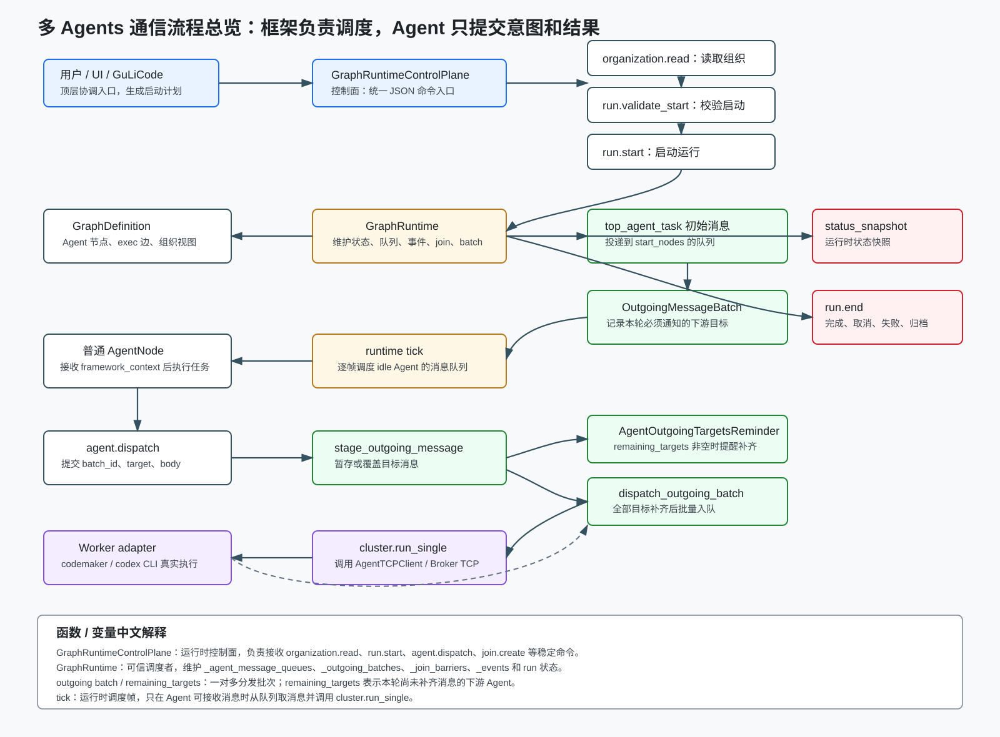

# multi_agent_tcp

A multi-agent runtime substrate for the current **GuLiCode desktop app + blueprint system** direction. The main line is: GuLiCode / UI submits a structured plan, `GraphRuntimeControlPlane` validates it, `GraphRuntime` schedules `AgentNode` queues, outgoing batches, fan-in joins, workspace state and events, and a pluggable execution backend runs the actual CLI worker when an AgentNode needs model work.

The low-level TCP worker path still exists, but it is now best understood as a backend adapter:

```text
GraphRuntime
  -> CLIWorkerBackend
  -> AgentTCPClient
  -> Broker
  -> Worker Agent process
  -> CLIAdapter
```

`CLIWorkerBackend` is the new semantic name for the old `CodeMakerCluster` concept. `CodeMakerCluster` remains as a backward-compatible alias, but new code and documentation should prefer `CLIWorkerBackend`.

## Architecture Diagrams

The current communication model is summarized in the main overview diagram:



### Agents 协同与工作区流转



中文注释：这张图把协作拆成三层：上层是用户、总控 Agent 和框架调度；中层是多个普通 AgentNode 并行处理子任务，并通过框架消息和共享引用协作；下层是工程目录、Agent 私有区、临时共享区、changeset 管道和长期归档。当前 `project_reference` 模式下，工程目录是代码权威源和最终代码目标，run 启动不再整体复制工程代码到 `shared/code`；Agent 私有区只按需 `checkout --path` / `--scope-path` 物化任务相关文件；临时共享区只保存报告、产物、manifest 和 changeset 引用，不承载工程代码副本。

More focused diagrams live in [`docs/diagrams/multi_agents_communication/`](docs/diagrams/multi_agents_communication/):

- [One-to-many outgoing batch dispatch](docs/diagrams/multi_agents_communication/02_fanout_dispatch.svg)
- [Fan-in join aggregation](docs/diagrams/multi_agents_communication/03_fanin_join.svg)
- [Appendix: CLIWorkerBackend TCP delivery path](docs/diagrams/multi_agents_communication/04_tcp_delivery.svg)

## Current Architecture Notes

- `GraphRuntimeControlPlane` is the non-UI control surface for organization reads, top-agent context, run start/status/end, outgoing message batches, ordinary `agent.dispatch`, and join contribution commands.
- `GraphRuntime` is the trusted scheduler. Agents do not directly message each other; they stage intent through framework APIs, and the runtime owns queueing, dispatch, reminders, join aggregation and event emission.
- `CLIWorkerBackend` is not the center of the blueprint architecture. It is one execution backend used when a scheduled AgentNode needs to call a CLI worker through TCP.
- In one-to-many dispatch, `stage_outgoing_message()` immediately returns `remaining_targets` to the caller after each `agent.dispatch`. Separately, `tick()` emits `AgentOutgoingTargetsReminder` only when the source Agent is idle/can accept messages and a staging batch still has missing targets. So the diagram concern about "should this wait for idle?" is a diagram wording issue, not a runtime bug: immediate return and idle reminder are two different feedback channels.

## Run-Scoped MCP Layer

Live blueprint runs can expose framework tools to Codex through a run-scoped
MCP server. The desktop service starts one local ASGI/uvicorn MCP handle per
live run with two tool boundaries:

- `framework_ordinary`: for ordinary `AgentNode` execution. It exposes scoped
  Workspace checkout/status/diff/submit/sync/publish/read/list/archive tools,
  scoped `agent_context`, scoped `agent_dispatch`, and scoped
  `join_contribute`.
- `framework_control`: for the Top Agent/control path. It exposes organization
  and top-agent context, run lifecycle, message batch/stage, control-side
  dispatch, join create/contribute, utterance inspection, and read-only
  Workspace inspection.

Tool availability is also enforced server-side with permission gates. Top
Agent does not receive Workspace write/submit/publish tools, and ordinary
Agents do not receive global lifecycle, utterance, message-batch, or
join-create tools.

The full live Codex MCP smoke is opt-in because it launches the real Codex CLI
and depends on local credentials/network/model availability:

```powershell
$env:MULTI_AGENT_TCP_RUN_REAL_CODEX_MCP = "1"
python -m pytest -q test_desktop_blueprint_service.py::test_real_codex_live_blueprint_uses_mcp_for_workspace_and_dispatch_flow -vv
```

## Requirements

- Python 3.10+
- `merge3` Python package is recommended for Dulwich-powered three-way text merges in the workspace changeset flow (`python -m pip install merge3`).
- MCP/live blueprint dependencies are declared in `pyproject.toml` and installed
  by `python -m pip install -e .`: `mcp`, `uvicorn`, `starlette`, and `httpx`.
- At least one supported agent CLI on `PATH`. Currently:
  - `codemaker` (non-interactive `codemaker run` with `--format json`) — fully supported via `codemaker_bridge.py`.
  - `codex` (non-interactive `codex exec --json`) is the current primary live
    Agent path, including private `CODEX_HOME`, Workspace API/MCP tools, and
    real-smoke coverage.
  - Other CLIs require future adapter work in this repository.
- Run with the **parent** of this folder on `PYTHONPATH`, or from a project that already imports `multi_agent_tcp` as a package.

For a durable command on PATH, install this checkout in editable mode:

```bash
python -m pip install -e .
multi-agent-tcp doctor --json
multi-agent-tcp show-registry
```

Example from `Package/Script/Python` (one level above this directory):

```bash
python -m multi_agent_tcp show-registry
python -m multi_agent_tcp dispatch --tasks path/to/tasks.json
```

See [`examples/HOWTO.txt`](examples/HOWTO.txt) for low-level setup and [`GUIDE_FOR_AGENTS.md`](GUIDE_FOR_AGENTS.md) for the standard two-step workflow that any agent CLI or script can use to dispatch tasks to peer agents. Optional local reference [`codemaker_cli.md`](codemaker_cli.md) is **not** in the public repo (gitignored); keep your own copy beside this package if you use it.

## Configuration

- Edit [`agents_registry.json`](agents_registry.json) for agent ids, **`cwd` (use an absolute path to your repo root in practice)**, models, and skills. The committed file uses `"."` as a placeholder.
- Run `python -m multi_agent_tcp.init_skill_list` to populate `skill_list/` (gitignored by default).

## Documentation map

| File | Purpose |
|------|---------|
| [`GUIDE_FOR_AGENTS.md`](GUIDE_FOR_AGENTS.md) | Standard two-step workflow for any agent CLI / script that wants to dispatch sub-tasks to peer agents. **Replaces** the legacy `GUIDE_FOR_CODEMAKER.md`. |
| [`examples/HOWTO.txt`](examples/HOWTO.txt) | Low-level: `broker` / `agent` / `spawn` / orchestrate recipes / library API. |
| [`KM_docs/skills-snapshot/`](KM_docs/skills-snapshot/) | Backup copy of the local `multi-agent-tcp` Codex skill snapshot. |
| [`codemaker_cli.md`](codemaker_cli.md) | (Local-only, gitignored) CodeMaker CLI reference notes. |

Latest focused MCP validation is tracked in
[`KM_docs/skills-snapshot/archive/blueprint_full_mcp_control_real_smoke_2026-05-19.md`](KM_docs/skills-snapshot/archive/blueprint_full_mcp_control_real_smoke_2026-05-19.md).

