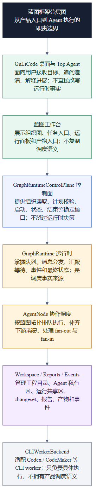
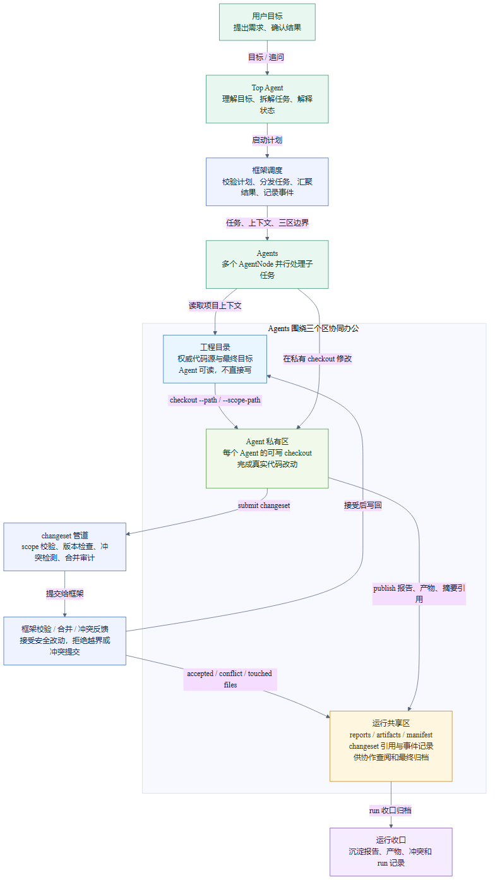

# multi_agent_tcp

`multi_agent_tcp` 是 GuLiCode 桌面多 Agent 蓝图系统的 Python 运行时底座。当前项目中心不是底层 TCP worker，也不是旧的 Ryven 编辑器，而是：

```text
GuLiCode 桌面 / Top Agent / 蓝图工作台
  -> GraphRuntimeControlPlane
  -> GraphRuntime
  -> AgentNode 队列、消息分发、汇聚等待、Workspace、事件
  -> CLIWorkerBackend
  -> Codex / CodeMaker 等 CLI worker
```

GuLiCode 桌面负责用户入口、蓝图编排体验和 Top Agent 规划；`GraphRuntimeControlPlane` 与 `GraphRuntime` 负责框架事实、调度和生命周期；`CLIWorkerBackend` 只是执行适配层，用来在需要模型工作时启动具体 CLI worker。

## 架构图

### 蓝图框架分层



这张图说明每一层的职责边界：产品入口在 GuLiCode 桌面和蓝图工作台，调度事实在 Python runtime，底层 CLI worker 不拥有产品调度语义。

### Agents 三区协同办公



这张图说明普通 Agents 如何围绕三个区协作：

- `工程目录`：权威代码源和最终代码目标。Agent 可以读取，但不能直接写。
- `Agent 私有区`：每个 Agent 的可写 `checkout_path`，真实代码改动在这里完成。
- `运行共享区`：保存 `reports`、`artifacts`、`manifest`、`changeset` 引用和事件记录。

代码协作必须走 `checkout -> edit -> status/diff -> submit`。报告和产物通过框架工具发布到运行共享区。

## 当前核心能力

- 蓝图工作台嵌入 GuLiCode 桌面：蓝图是项目级能力，运行在当前 project/workspace 语义下。
- Top Agent 规划入口：GuLiCode 当前桌面会话承担 Top Agent 产品角色，负责理解目标、拆解任务、提交启动计划和解释状态。
- 运行时控制面：`GraphRuntimeControlPlane` 提供组织读取、计划校验、启动、状态、结束、消息批次、Agent dispatch、join 等稳定接口。
- 图调度运行时：`GraphRuntime` 负责 AgentNode 队列、消息投递、fan-out、fan-in、idle 提醒、事件、取消、归档和最终状态。
- Workspace 三个区：工程目录只读给 Agent，Agent 私有区可写，运行共享区沉淀报告、产物、manifest、changeset 和冲突记录。
- MCP 工具边界：live blueprint run 可启动 run-scoped MCP 服务，为普通 Agent 和 Top Agent 暴露不同工具集合。
- Codex-first 适配：当前 live Agent 主线优先使用 Codex CLI；CodeMaker 保留为兼容和备选路径。

## 快速开始

### Python 运行时

建议使用 Python 3.10+，在本仓库根目录安装 editable package：

```powershell
python -m pip install -e .
multi-agent-tcp doctor --json
multi-agent-tcp show-registry
```

也可以从本目录的上一级用模块方式运行：

```powershell
python -m multi_agent_tcp show-registry
python -m multi_agent_tcp organization --graph path\to\graph.json
```

### GuLiCode 桌面

Windows 推荐入口：

```powershell
.\start-gulicode-desktop.cmd
```

跨平台终端入口：

```powershell
cd GuLiCode
bun run desktop
```

打包烟测入口：

```powershell
.\start-gulicode-desktop.cmd --packaged
```

启动成功通常会看到 renderer dev server、Electron app started、sidecar server ready 等日志标记。详细桌面启动和打包注意事项见 `KM_docs/skills-snapshot/knowledge_base/gulicode_desktop.md`。

## 开发与验证

### Python runtime

常用验证命令：

```powershell
python -m py_compile graph_runtime.py graph_control.py blueprint_mcp_runtime.py agent_launch_context.py desktop_blueprint_service.py
pytest -q test_agent_runtime.py -k "not real_codex"
pytest -q test_desktop_blueprint_service.py
pytest -q test_workspace_api.py test_workspace_manager.py
```

真实 Codex smoke 依赖本机 Codex、模型、凭据和网络状态，默认不作为普通 CI 路径：

```powershell
$env:MULTI_AGENT_TCP_RUN_REAL_CODEX_MCP = "1"
python -m pytest -q test_desktop_blueprint_service.py::test_real_codex_live_blueprint_uses_mcp_for_workspace_and_dispatch_flow -vv
```

### GuLiCode app

常用验证命令：

```powershell
cd GuLiCode\packages\app
bun test --preload ./happydom.ts ./src/pages/session/blueprint-side-panel.test.ts ./src/i18n/parity.test.ts
bun run typecheck
```

Electron 侧常用验证：

```powershell
cd GuLiCode\packages\desktop-electron
bun test ./src/main/ipc-blueprint-runtime.test.ts
bun run typecheck
```

## 目录导览

| 路径 | 说明 |
| --- | --- |
| `GuLiCode/` | GuLiCode 桌面产品代码，包含 Electron shell、SolidJS app、OpenCode vendor 基线和桌面启动脚本。 |
| `graph_runtime.py` | 核心运行时：AgentNode 队列、dispatch、join、workspace 状态、事件和最终状态。 |
| `graph_control.py` | Runtime control-plane 包装层，提供组织读取、start/status/end、message batch、join 等接口。 |
| `desktop_blueprint_service.py` | GuLiCode 桌面与 Python runtime 之间的服务外壳。 |
| `blueprint_mcp_runtime.py` | live blueprint run 的 MCP 工具边界与 run-scoped MCP 服务。 |
| `workspace_manager.py` / `workspace_api.py` / `workspace_rpc.py` | 三个区、private checkout、changeset、冲突检测、报告和产物发布。 |
| `codex_bridge.py` / `codemaker_bridge.py` / `cluster.py` | CLI worker 适配和兼容层。新文档中优先使用 `CLIWorkerBackend` 这个语义名。 |
| `docs/` | 设计文档、Workspace API 说明、蓝图 fixture、架构图。 |
| `KM_docs/skills-snapshot/` | 当前 Codex skill 知识快照，记录近期架构方向、验证命令和交接状态。 |
| `skill_list/` | 本地 Agent skill 目录，通常由 `python -m multi_agent_tcp.init_skill_list` 初始化。 |
| `test_*.py` | Python runtime、workspace、desktop service、control-plane 的测试。 |

## 当前边界

- 不把低层 TCP worker 当作产品中心。它只是 `CLIWorkerBackend` 后面的一个执行路径。
- 不恢复旧 Ryven/editor UI 作为主线。当前蓝图能力应嵌入 GuLiCode 桌面。
- 普通 Agents 不直接互发消息。它们通过框架 API 暂存 dispatch 意图，由 `GraphRuntime` 校验并投递。
- 普通 Agents 不直接写工程目录或运行共享区。代码改动进入私有 checkout，提交 changeset 后由框架校验、合并或返回冲突。
- Top Agent 不直接改写 runtime 内部状态。它读取组织上下文、提交结构化计划、解释状态，并通过控制面请求生命周期动作。
- UI 不复制调度语义。GuLiCode 前端消费 runtime/control-plane 状态，不重新实现队列、join、workspace 决策。

## 相关文档

- `docs/workspace_api.md`：Workspace 三个区、checkout/status/diff/submit/publish 的当前契约。
- `docs/gulicode_blueprint_workbench_design.md`：GuLiCode 蓝图工作台的产品和技术边界。
- `KM_docs/skills-snapshot/knowledge_base/core_architecture.md`：当前核心架构快照。
- `KM_docs/skills-snapshot/knowledge_base/dispatch_workflows.md`：runtime control-plane 和消息分发工作流。
- `KM_docs/skills-snapshot/knowledge_base/gulicode_desktop.md`：GuLiCode 桌面启动、打包和本机验证规则。
